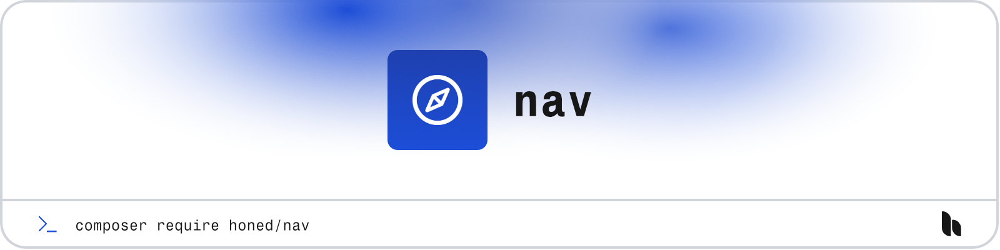

> **Caution:** This package is currently under development and not ready for production use. Tag v1.0.0 will indicate a stable release.

<a href="https://honed.dev/nav">
    <picture>
        <source media="(prefers-color-scheme: dark)" srcset="art/header-dark.png">
        
    </picture>
</a>

# Nav

<p>
    <a href="https://github.com/honedlabs/nav/actions"></a>
    <a href="https://packagist.org/packages/honed/nav"></a>
    <a href="https://packagist.org/packages/honed/nav"></a>
</p>

**Nav** provides a simple way to define and authorize navigation routes in Laravel on your backend, and then share them to your frontend.

## Installation

> **Requires [PHP 8.2+](https://php.net/releases/)**

> **Requires [Laravel 11+](https://laravel.com/docs/releases).**

> **Requires [Inertia.js 1.2+](https://inertiajs.com/server-side-setup)**

Get started with the package by requiring it in your PHP project using [Composer](https://getcomposer.org/).

```bash
composer require honed/nav
```

## Companion

> **Requires [Vue.js 3.4+](https://vuejs.org/about/releases.html).**

> **Requires [Inertia.js 1.2+](https://inertiajs.com/client-side-setup)**

Get started with the [companion package](https://github.com/honedlabs/nav-vue) by installing it as a node dependency via [NPM](https://npmjs.com).

```bash
npm install @honed/nav
```

## Documentation

Please refer to the [documentation](https://honed.dev/nav) for the usage of the package.

## License

**Nav** was created by [Joshua Wallace](https://joshua-wallace.com) under the [MIT license](https://opensource.org/licenses/MIT).